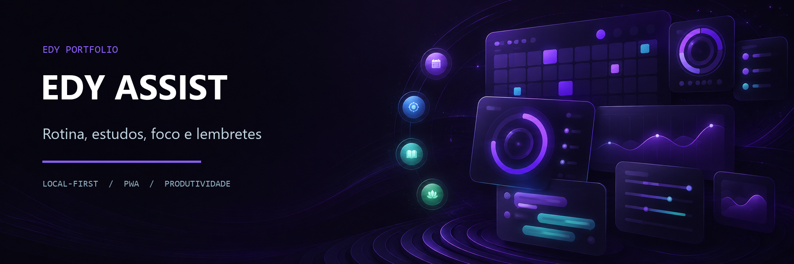
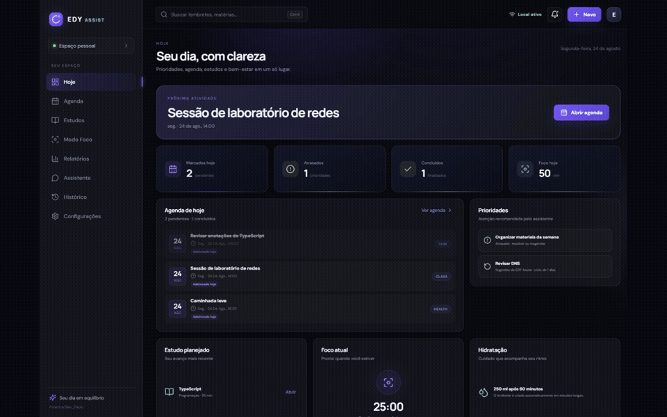
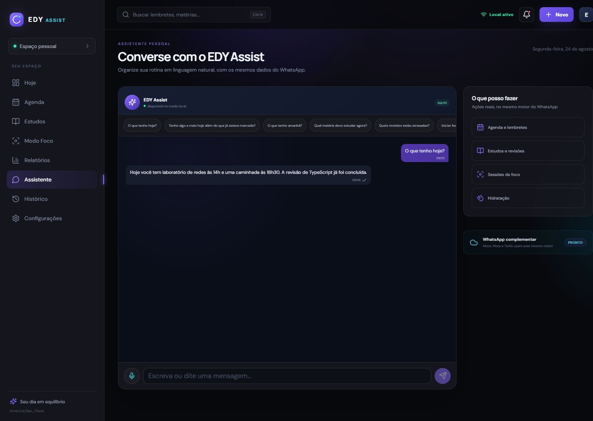
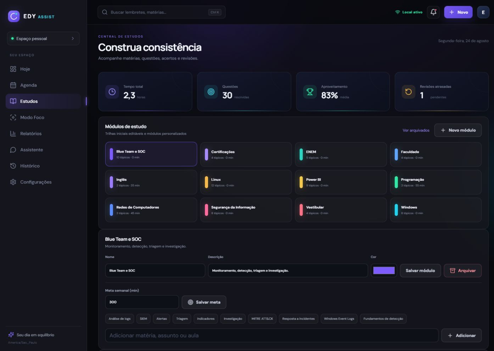
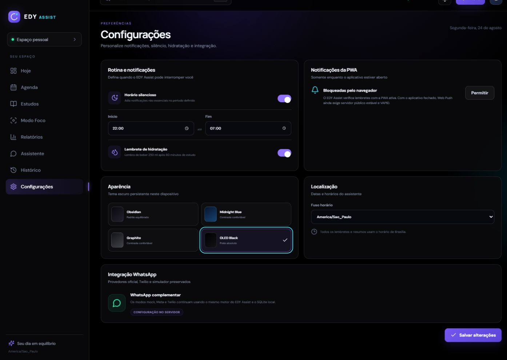

# EDY Assist

Assistente pessoal mobile-first em português para rotina, estudos, foco e lembretes, com PWA, monitoramento de aprendizagem e integração WhatsApp.

    

> Beta de portfólio: o modo local funciona sem credenciais. Integrações externas permanecem opcionais e exigem configuração do próprio operador.

## Apresentação em vídeo

https://github.com/user-attachments/assets/a7af6347-bd9a-4434-b068-e0f83254fd05

## Visão geral

O EDY Assist reúne agenda, sessões de foco, estudos, revisões espaçadas, relatórios e um assistente em linguagem natural. O painel React e os canais local, Meta e Twilio compartilham o mesmo motor de domínio e persistem dados em SQLite.



## Destaques

- PWA responsiva e instalável, com shell offline e atualização controlada;
- tela Hoje com agenda, atrasos, conclusões, estudo, revisão e foco;
- lembretes únicos ou recorrentes, com concluir, cancelar, adiar e reagendar;
- sessões de foco e lembrete opcional de hidratação;
- trilhas de estudo, questões, acertos, dificuldade e metas semanais;
- revisões espaçadas em 1, 3, 7, 15 e 30 dias;
- relatórios diários e semanais derivados do SQLite;
- assistente em português com histórico persistente e confirmação de ambiguidades;
- temas Obsidian, Midnight Blue, Graphite e OLED Black;
- provedores `mock`, Meta Cloud API e Twilio WhatsApp, sem chamadas externas no modo local.

## Galeria

| Hoje no celular | Assistente | Estudos |
|---|---|---|
|  |  |  |



As capturas usam exclusivamente a base criada por `npm run demo:seed`. Nenhum banco pessoal, conversa real ou número de telefone foi usado.

## Stack

- Node.js 20.19+ e TypeScript;
- Express, Helmet e Zod;
- React 19, Vite, Motion, Recharts e Base UI;
- Prisma Client 7 com SQLite e `better-sqlite3`;
- Vitest e Supertest;
- PWA com manifest, service worker e página offline;
- SDKs oficiais para Meta Cloud API e Twilio WhatsApp.

## Arquitetura

```text
PWA React/Vite ── /api ──> Express ──> serviços de domínio ──> Prisma ──> SQLite
                                  ▲
Simulador local ──────────────────┤
Webhook Meta ─────────────────────┤
Webhook Twilio ───────────────────┘
```

Os webhooks convergem no mesmo processamento usado pelo simulador local. Identificadores externos são persistidos para evitar o processamento duplicado de uma mesma mensagem.

Detalhes: [Arquitetura](docs/ARCHITECTURE.md).

## Executar localmente

```powershell
git clone https://github.com/EDY075/EDY-Assist.git
Set-Location EDY-Assist
Copy-Item .env.example .env
npm ci
npm run prisma:generate
npm run db:init
npm run db:seed
npm run dev
```

- painel de desenvolvimento: `http://127.0.0.1:5173`;
- API local: `http://127.0.0.1:3333`;
- health check: `http://127.0.0.1:3333/api/health`.

Consulte [Configuração local](docs/LOCAL_SETUP.md) e [Início rápido](QUICKSTART.md).

## Base demonstrativa segura

```powershell
npm run prisma:generate
npm run demo:seed
```

O comando cria ou atualiza somente `.demo/edy-assist-demo.db`, arquivo ignorado pelo Git. O script contém uma proteção explícita e encerra com erro se o destino estiver fora de `.demo/`. Ele não lê nem altera `prisma/dev.db`.

## Qualidade

```powershell
npm run prisma:generate
npm run typecheck
npm test
npm run build
```

A integração contínua executa os mesmos gates em ambiente de teste, com SQLite isolado, provedor mock e sem credenciais reais ou chamadas externas.

## WhatsApp

O modo `mock` é o padrão e não precisa de conta externa. Meta Cloud API e Twilio são integrações opcionais, desativadas até que o operador configure seu próprio `.env` e um endpoint HTTPS.

- [Visão consolidada da integração](docs/WHATSAPP_INTEGRATION.md)
- [Configuração Meta](META_SETUP.md)
- [Configuração Twilio](TWILIO_SETUP.md)

Credenciais, destinatários, logs, QR codes, bancos SQLite e URLs temporárias nunca devem ser versionados.

## Scripts principais

| Comando | Finalidade |
|---|---|
| `npm run dev` | API e painel em desenvolvimento |
| `npm run build` | Typecheck e bundle de produção |
| `npm test` | Suíte automatizada |
| `npm run db:init` | Aplica as migrations SQL ao SQLite configurado |
| `npm run db:seed` | Cria apenas a configuração inicial |
| `npm run demo:seed` | Prepara uma base fictícia isolada para demonstração |
| `npm run prisma:generate` | Gera o Prisma Client localmente |
| `start-mobile.bat` | Prepara a PWA local e um túnel temporário para teste próprio |

## Limitações conhecidas

- não há autenticação de usuários; não hospede publicamente sem adicioná-la;
- a PWA não possui sincronização de dados offline;
- Web Push com o aplicativo fechado não está implementado;
- o fluxo móvel temporário depende do computador e do processo local ativos;
- integrações WhatsApp dependem de contas, regras e credenciais do operador;
- este repositório não inclui deploy pago, domínio, GitHub Pages ou banco gerenciado.

## Segurança e contribuição

Leia [SECURITY.md](SECURITY.md) antes de reportar vulnerabilidades e [CONTRIBUTING.md](CONTRIBUTING.md) antes de contribuir. O histórico de versões está em [CHANGELOG.md](CHANGELOG.md).

Nenhuma licença de código aberto foi definida para este repositório. A ausência de um arquivo de licença não concede permissão de uso, cópia, modificação ou redistribuição.

## Autor

**Edmilson Gomes** — [GitHub @EDY075](https://github.com/EDY075)
